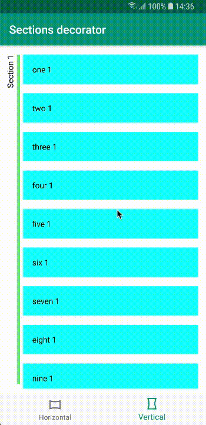

# Sections decorator

## About
Sections decorator is RecyclerView decorator that decorates multi section recycler with vertical / horizontal line and section title.
Current section title is always visible. It might be useful in todo list or calendar like applications. 
 

## Usage

1. Add jitpack.io to your build.gradle
```groovy
repositories {
    mavenCentral()
    maven { url 'https://jitpack.io' }
}
```
2. Add library dependency
```groovy
implementation 'com.github.netguru:sections-decorator-android:0.1.0'
```
 
3. implement SectionsAdapterInterface in your RecyclerView adapter
 - see example in [Sample app](app/src/main/kotlin/co/netguru/android/sectionsDecoratorDemo/feature/demo/Adapter.kt)

4. add decorator to your RecyclerView  

kotlin:
```kotlin
recyclerView.addItemDecoration(SectionDecorator(context).apply {
            setLineColor(R.color.green)
            setLineWidth(15f)
        })
```
  
java:
```java
SectionDecorator decorator = new SectionDecorator(getContext());
decorator.setLineColor(R.color.green)
decorator.setLineWidth(15f)
recyclerView.addItemDecoration(decorator);
```
5. Customize

## Customization
you can customize line color and width through `setLineColor(color: Int)` and `setLineWidth(width: Float)`.
To customize text appearience you can create layout with only TextView in it and pass it to decorator using 
`setHeaderView(layoutRes: Int)`

## License  
```
Copyright 2018 Netguru

Licensed under the Apache License, Version 2.0 (the "License");
you may not use this file except in compliance with the License.
You may obtain a copy of the License at

   http://www.apache.org/licenses/LICENSE-2.0

Unless required by applicable law or agreed to in writing, software
distributed under the License is distributed on an "AS IS" BASIS,
WITHOUT WARRANTIES OR CONDITIONS OF ANY KIND, either express or implied.
See the License for the specific language governing permissions and
limitations under the License.
```
